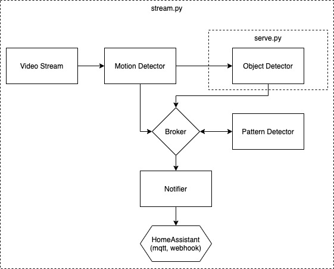

### Argos

a spacial-temporal pattern detection system for home automation. Based on [OpenCV](https://opencv.org/) and [Tensorflow](http://tensorflow.org/), can run on raspberry pi and notify [HomeAssistant](hass.io) via MQTT or webhooks.

[](https://www.youtube.com/watch?v=YiPb35GiyDE)


#### Architecture



#### Synopsis

* Take a video input (a raspberry pi camera if run on a rpi, an RTMP stream of a security cam, or a video file)

* Run a simple motion detection algorithm on the stream, applying minimum box thresholds, negative masks and masks

* Run object detection on either the cropped frame where motion was detected or even the whole frame if needed, [using tensorflow object detection API](https://github.com/tensorflow/models/tree/master/research/object_detection). There is support for both tensorflow 1 and 2 as well as [tensorflow lite](https://www.tensorflow.org/lite/models/object_detection/overview), and custom models as well

* Serves a flask webserver to allow you to see the motion detection and object detection in action, serve a mpeg stream which can be configured as a camera in [HomeAssistant](http://hass.io/)

* Object detection is also highly configurable to threshold or mask out false positives

* Object detection features an optional "detection buffer' which can be used to get the average detection in moving window of frames before reporting the maximum cumulative average detection

* Supports sending notificaitons to [HomeAssistant](http://hass.io/) via MQTT or webhooks. Webhook notification send the frame on which the detection was triggered, to allow you to create rich media notifications from it via the HA android or iOS apps.

* Pattern detection: both the motion-detector and object-detector send events to a queue which is monitored and analyzed by a pattern detector. You can configure your own "movement patterns" - e.g. a person is exiting a door or entering a door, or your dog is going to the kitchen. It keeps a configurable history of states (motion detected in a mask, outside a mask, object detected (e.g. person), etc.) and your movement patterns are pre-configured sequence of states which identify that movement. `door_detect.py` provides a movement pattern detector to detect if someone is entering or exiting a door

* All of the above functionality is provided by running "stream.py". There's also "serve.py" which serves as an object detection service which can be called remotely from a low-grade CPU device like a raspberry pi zero w which cannot run tensorflow lite on its own. The motion detector can still be run on the pi zero, and only object detection can be done remotely by calling this service, making a distributed setup.

* Architected to be highly concurrent and asynchronous (uses threads and queue's between all the components - flask server, motion detector, object detector, pattern detector, notifier, mqtt, etc)

* Has tools to help you generate masks, test and tune the detectors, etc.

* Every aspect of every detector can be tuned in the config files (which are purposefully kept as python classes and not yaml), every aspect is logged with colored output on the console for you to debug what is going on.

  

#### Usage

*stream.py* - runs the motion detector, object detector (with detection buffer) and pattern detector

```bash
stream.py --ip 0.0.0.0 --port 8081 --config configs.config_tflite_ssd_example
```

http://your-ip:8081/ will show a web page with the real time processing of the input video stream, and a separate video stream showing the object detector output

GET http://your-ip:8081/status shows the current load on the system

GET http://your-ip:8081/config shows the config

GET http://your-ip:8081/config?<param>=<value> will let you edit any config parameter without restarting the service

GET http://your-ip:8081/image shows the latest frame as a JPEG image (useful in HA [generic camera](https://www.home-assistant.io/integrations/generic/) platform)

GET http://your-ip:8081/video_feed streams an MJPEG video stream of the motion detector (useful in HA [generic camera](https://www.home-assistant.io/integrations/generic/) platform)

GET http://your-ip:8081/od_video_feed streams an MJPEG video stream of the object detector

*serve.py*

```bash
serve.py --ip 0.0.0.0 --port 8080 --config configs.config_tflite_ssd_example --uploadfolder upload
```

POST http://your-ip:8081/detect
```
  file: the jpeg file to run the object detector on
  threshold: object detector threshold (override config.tf_accuracy_threshold)
  nmask: base64 encoded python tuple containing the negative mask to apply. format: (xmin, ymin, xmax, ymax)
```

#### Home assistant automations

[ha_automations/notify_door_movement_at_entrance.yaml](ha_automations/notify_door_movement_at_entrance.yaml) - triggered by pattern detector

[ha_automations/notify_person_is_at_entrance.yaml](ha_automations/notify_person_is_at_entrance.yaml) - triggered by object detector

both of these use HA webhooks. i used MQTT earlier but it was too delayed and unreliable for my taste. the project still supports MQTT though and you'll have to make mqtt sensors in HA for the topics you're sending the notifications to here.

#### Configuration

both stream.py and serve.py share some configuration for the object detection, but stream.py builds on top of that with a lot more configuration for the motion detector, object detection buffer, pattern detector, and stream input configuration, etc. The [example config](configs/examples/config_tflite_ssd_stream.py) documents the meaning of all the parameters

#### Performance

This runs at the following FPS with everything on my raspberry pi 4B:

* motion detector - 18 fps
* object detector (tflite) - 5 fps

I actually run multiple of these for different RTMP cameras, each at 1 fps (which is more than enough for all real time home automation use cases)

#### Footnote

This is my own personal project. It is not really written in a readable way with friendly abstractions, as that wasn't the goal. The goal was to solve my home automation problem quickly so that I can get back to real work :) So feel free to pick and choose snippets of code as you like or the whole solution if it fits your use case. No compromises were made in performance or accuracy, only 'coding best practices'. I usually keep such projects private but thought this is now meaty enough to be usable to someone else in ways I cannot imagine, so don't judge this project on its maturity or [reuse readiness level](http://oss-watch.ac.uk/resources/reusereadinessrating) ;) . Feel free to fork this project and make this an extendable framework if you have the time.

Special thanks to these resources on the [web](references.txt) for helping me build this.
